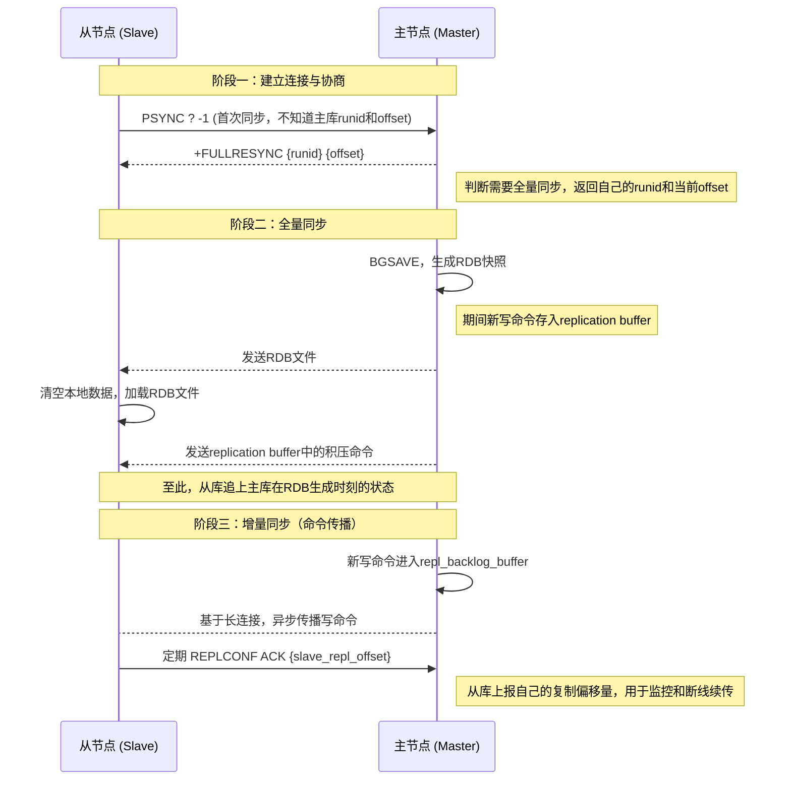

# Redis之主从复制

Redis的主从复制机制是实现高可用性和扩展读性能的基石。它的核心思想可以概括为：**基于「共享主从复制ID + 偏移量」的精巧设计，通过「全量同步 + 增量同步」的组合策略，高效地保证主从节点数据最终一致。**

下面，我将带你彻底拆解这个机制。

## 0. 主从复制全景图

在深入细节前，我们先通过一张流程图，从宏观上把握一次完整的主从同步过程。这能帮你建立起全局视角，更好地理解后续的每个环节。

## 1. 核心概念：复制的三大基石

主从复制能高效运行，依赖于三个关键的数据结构和标识，它们是整个机制的“地基”。

*   **复制ID (Replication ID)**：这是一个40位的随机字符串，可以理解为数据集的“版本号”或“基因”。每个主节点启动时都会生成一个唯一的复制ID。从节点在进行首次同步时，会继承主节点的复制ID。如果两个实例的复制ID和偏移量都相同，就意味着它们的数据完全一致。

*   **复制偏移量 (Replication Offset)**：这是数据集的“行踪记录”。主节点和每个从节点都会维护一个自己的偏移量。主节点每向从节点发送N个字节的数据，其`master_repl_offset`就增加N。从节点每接收并应用N个字节的数据，其`slave_repl_offset`也相应增加。通过对比这两个偏移量，就能精确判断主从数据之间的差距。

*   **复制积压缓冲区 (Replication Backlog Buffer)**：这是主节点上的一个**固定大小、先进先出（FIFO）的环形缓冲区**。当主节点接收写命令时，这些命令不仅会发给从节点，还会被写入这个缓冲区。它的核心作用是**支持网络闪断后的增量同步**。当从节点重连并上报自己的偏移量时，主节点会检查该偏移量之后的数据是否还在缓冲区中。如果在，就只需发送这部分缺失的命令（增量同步）；如果不在，则说明落后的数据太多，只能进行全量同步。

*   **运行ID (Run ID)**：每个Redis实例启动时生成的唯一标识。从节点首次同步时会记录主节点的运行ID。如果主节点重启，其运行ID会改变，从节点检测到后，会认为这是一个全新的主节点，从而触发一次新的全量同步。这是一种安全机制，防止从节点错误地从一个数据状态不同的新主节点上继续增量同步。

## 2. 全量同步：从无到有的构建

当从节点第一次连接主节点，或者由于网络中断太久导致无法进行增量同步时，就会触发全量同步。这个过程可以细分为三个阶段：

*   **阶段一：建立连接与协商**
    1.  从节点向主节点发送 `PSYNC ? -1` 命令，表示自己需要进行全量同步。
    2.  主节点响应 `+FULLRESYNC {runid} {offset}`，告知从节点自己的运行ID和当前偏移量，为后续的增量同步做好准备。

*   **阶段二：主节点生成并传输RDB**
    1.  主节点执行 `BGSAVE` 命令，fork一个子进程来生成包含所有数据的RDB快照文件。这个过程不会阻塞主节点的正常服务。
    2.  **关键点**：在生成RDB的期间，所有新的写命令都会被主节点记录在一个名为 **`replication buffer`** (复制客户端缓冲区) 的内存区域中。
    3.  RDB文件生成完毕后，主节点将其发送给从节点。从节点接收前，会先清空自己的所有旧数据，然后加载RDB文件，将自己恢复到主节点生成RDB那一刻的状态。

*   **阶段三：缓冲命令的补发与后续同步**
    1.  RDB文件传输完成后，主节点会将 `replication buffer` 中积压的所有写命令发送给从节点。
    2.  从节点执行这些命令，从而追赶上主节点在RDB生成之后的数据变化。
    3.  至此，全量同步完成。主从节点之间会建立起一个**长连接**，进入命令传播（增量同步）阶段。

## 3. 增量同步（命令传播）：持续性的保持

全量同步完成后，如何保持主从数据的持续一致呢？答案就是基于长连接的增量同步，也叫命令传播。

*   **异步复制**：默认情况下，Redis的复制是**异步**的。主节点处理完一个写命令后，会立即返回结果给客户端，同时将该命令异步地发送给所有从节点。这种方式保证了Redis的高性能。
*   **心跳检测**：为了维持连接和监控状态，从节点会以每秒一次的频率，向主节点发送 `REPLCONF ACK {offset}` 命令。这个命令有两个重要作用：
    1.  上报自己当前的复制偏移量，让主节点可以监控从节点的同步进度。
    2.  如果主节点超过 `repl-timeout`（默认60秒）没有收到从节点的任何消息，就会判定该从节点下线，断开连接。

## 4. 关键优化机制

理解了核心流程，我们再来看几个关键的优化点，它们让复制机制更加强大和可靠。

*   **无盘复制 (Diskless Replication)**：在传统的全量同步中，主节点需要先将RDB文件写入磁盘，再从磁盘读取并发送，这会带来两次磁盘I/O开销。从Redis 2.8.18开始支持的无盘复制，允许子进程直接将RDB数据通过网络套接字（Socket）发送给从节点，**完全绕过了磁盘**。这对于磁盘性能较慢但网络带宽充足的场景，能显著提升同步效率。

*   **RDB文件复用**：如果多个从节点几乎同时请求全量同步，主节点会为每个从节点都生成一份RDB吗？答案是否定的。Redis会复用正在进行中的`BGSAVE`生成的RDB文件。如果有从节点在RDB生成期间请求同步，它们会被加入到等待队列中，等这个RDB文件生成完毕后，主节点会将其依次发送给这些从节点，同时也会为每个从节点准备独立的 `replication buffer` 来记录后续的增量命令，以保证数据对齐。

*   **主-从-从链式结构**：为了进一步减轻主节点在全量同步时的压力（尤其是传输RDB的网络开销），可以引入“中间层”。让一个从节点同时作为其他从节点的“主节点”，形成 `master -> slave(A) -> slave(B)` 的链式结构。这样，生成RDB和传输RDB的压力就被分担到了从节点A上。

*   **`WAIT` 指令：从异步到同步的补充**
    Redis默认是异步复制，但在某些对数据一致性要求极高的场景下，这可能导致数据丢失（例如，主节点确认写操作后立即宕机，数据还没来得及同步给从节点）。为此，Redis提供了 `WAIT <numreplicas> <timeout>` 命令。客户端在执行写操作后，可以调用 `WAIT` 命令阻塞等待，直到至少有 `numreplicas` 个从节点确认收到了该写操作。这提供了一种**可选的同步复制**能力，在性能和数据可靠性之间取得了平衡。

## 总结

Redis的主从复制是一个精妙的设计。它以 **复制ID** 标识数据族谱，以 **偏移量** 追踪同步进度，通过**全量同步**（RDB + replication buffer）建立副本，再以**增量同步**（命令传播 + backlog buffer）维持实时一致。辅以**无盘复制**、**RDB复用**等优化，以及 `WAIT` 指令提供的同步选项，共同构建了一个既高性能又足够可靠的数据复制体系，为上层的高可用架构（哨兵、集群）打下了坚实的基础。